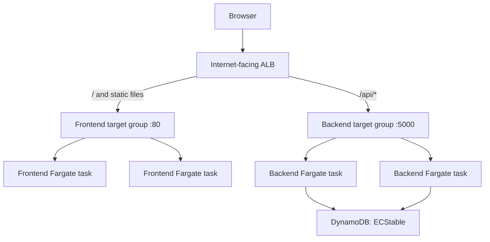
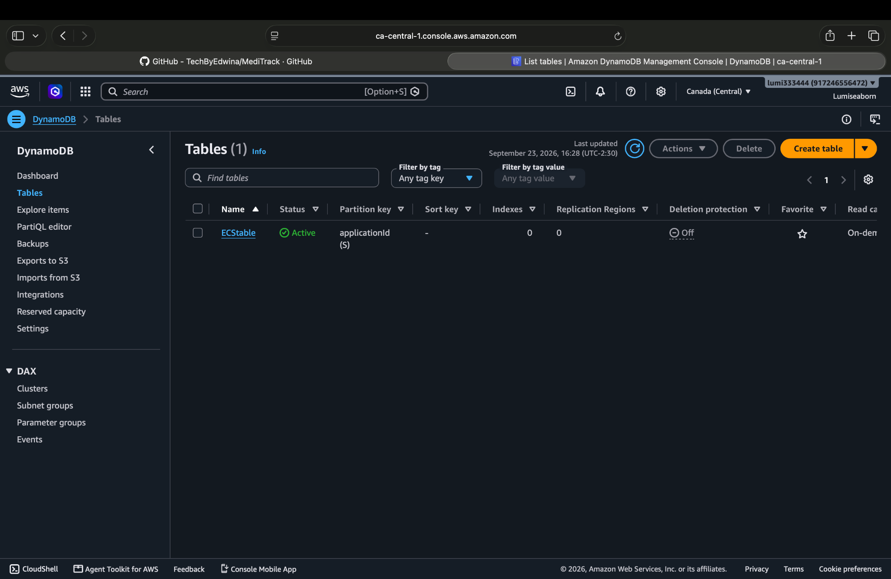
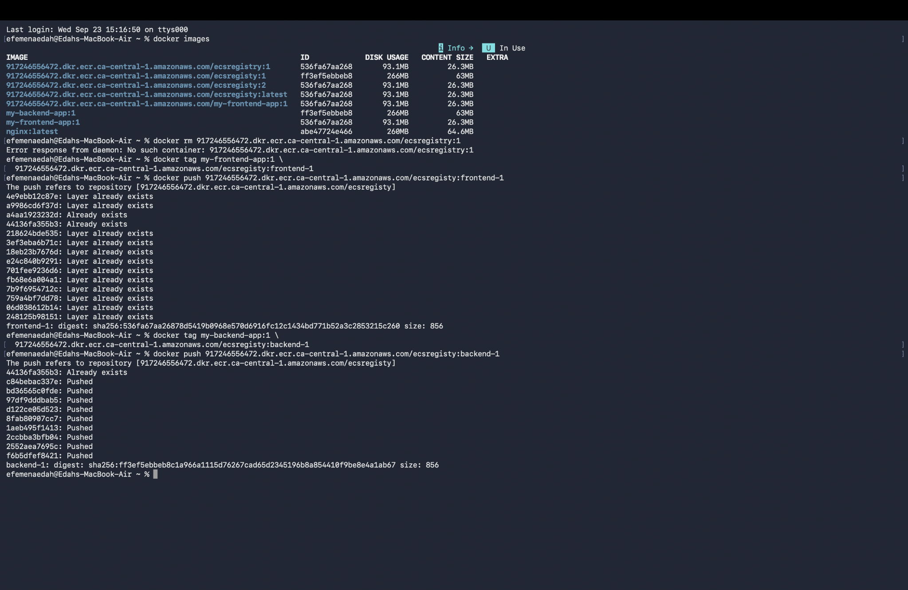
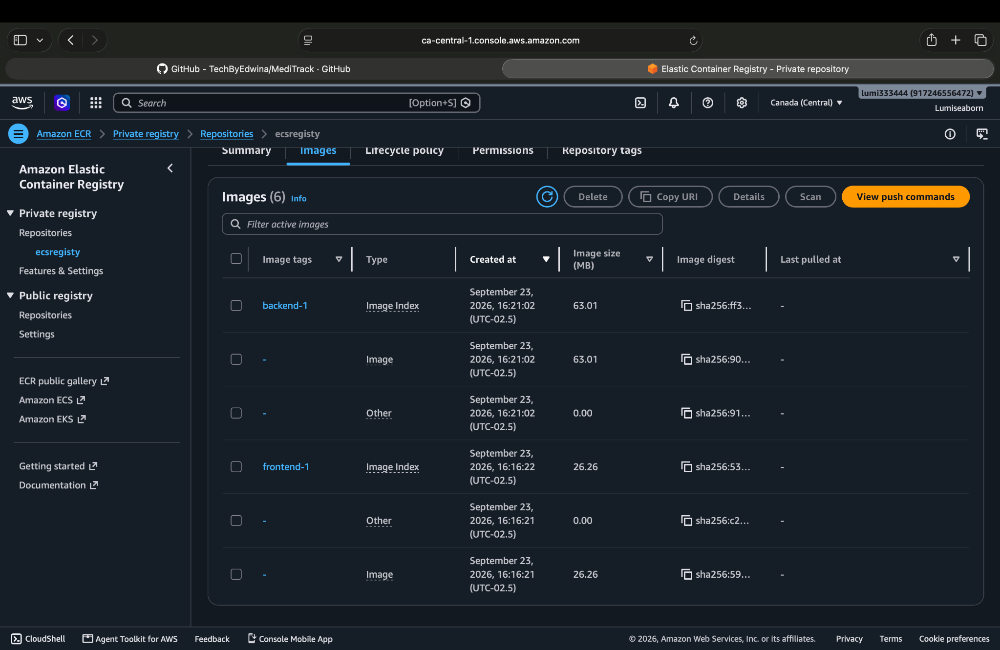
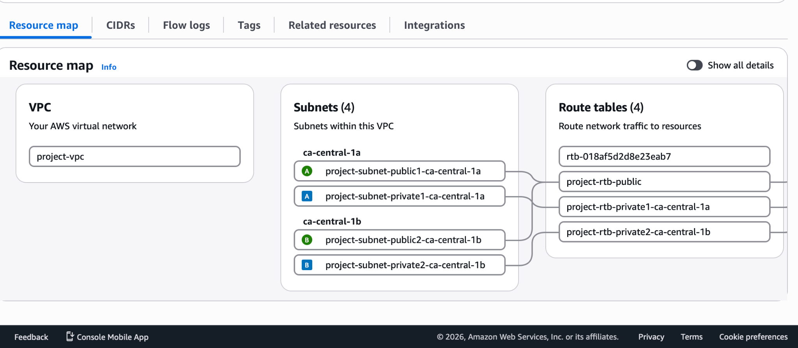
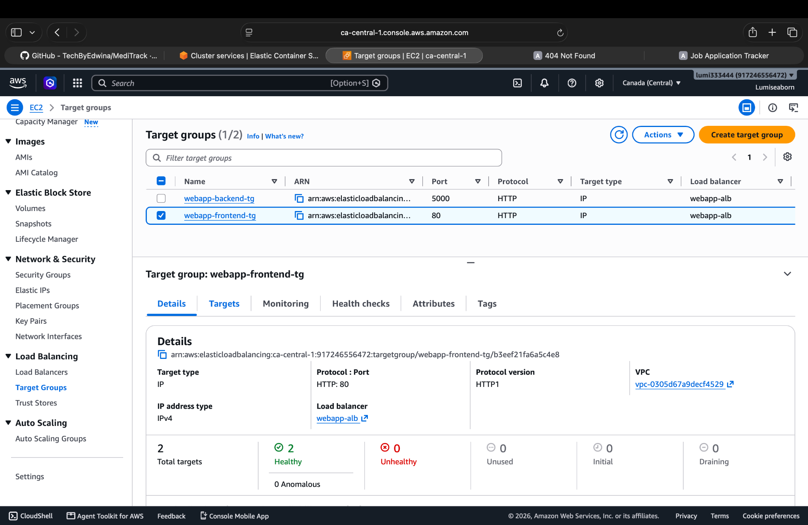
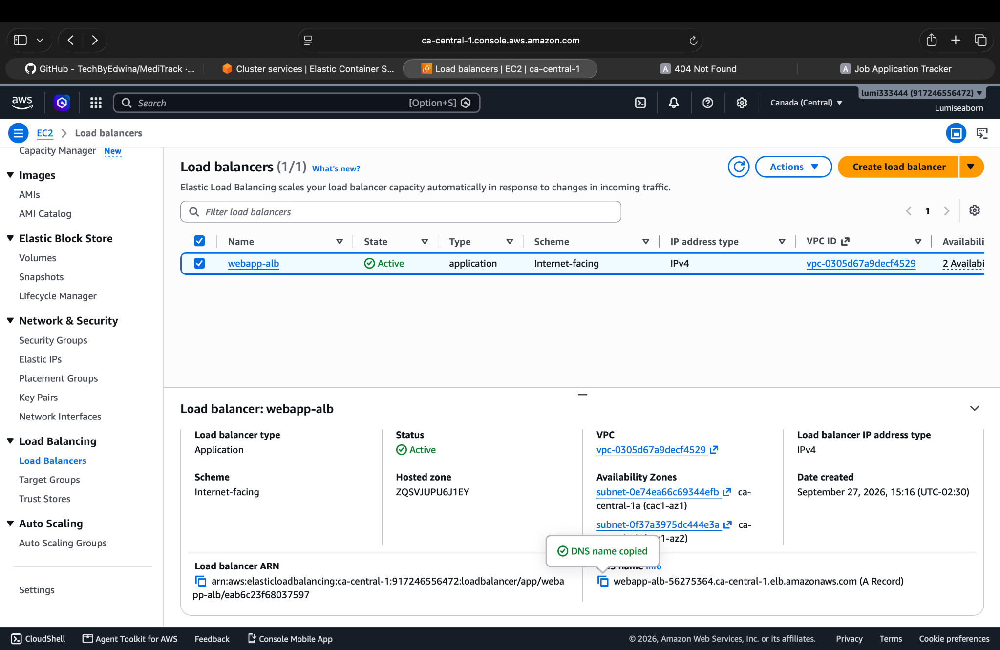
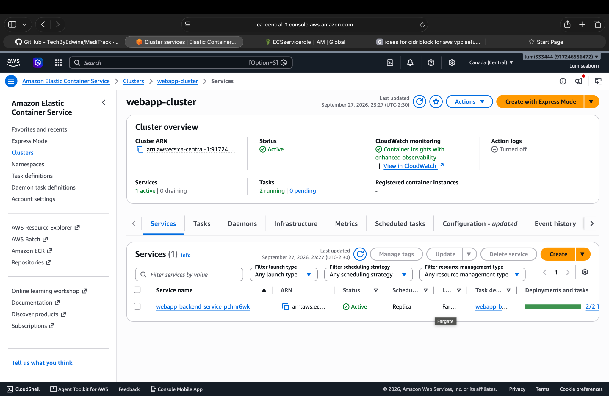

# AWS ECS Application Deployment with DynamoDB Integration

[](https://aws.amazon.com/ecs/)
[](https://www.docker.com/)
[](https://flask.palletsprojects.com/)
[](https://aws.amazon.com/dynamodb/)
[](LICENSE)

A production-style, two-tier Job Application Tracker deployed on Amazon ECS Fargate. The static frontend runs in NGINX, the Python backend runs with Flask and Gunicorn, an internet-facing Application Load Balancer performs path-based routing, and Amazon DynamoDB provides managed persistence.

> This repository documents a completed hands-on deployment in the Canada (Central) Region. It intentionally excludes exported Docker image archives and credentials. The containers can be rebuilt from the included source and Dockerfiles.

## Architecture



The ALB is deployed in two public subnets. The frontend and backend tasks are deployed in private subnets across two Availability Zones. Backend tasks access DynamoDB using the permissions assigned to the ECS task role.

## Deployed resource summary

| Component | Project setting |
|---|---|
| AWS Region | `ca-central-1` |
| AWS account | `917246556472` |
| VPC | `project-vpc` — `10.0.0.0/16` |
| Availability Zones | `ca-central-1a`, `ca-central-1b` |
| ECR repository | `ecsregisty` |
| Frontend image tag | `frontend-1` |
| Backend image tag | `backend-1` |
| DynamoDB table | `ECStable` |
| DynamoDB partition key | `applicationId` (String) |
| ECS cluster | `webapp-cluster` |
| Application Load Balancer | `webapp-alb` |
| Frontend target group | `webapp-frontend-tg` — HTTP `80` |
| Backend target group | `webapp-backend-tg` — HTTP `5000` |

## Repository structure

```text
.
├── backend/
│   ├── app.py
│   ├── requirements.txt
│   └── .dockerignore
├── docker/
│   ├── backend.Dockerfile
│   └── frontend.Dockerfile
├── frontend/
│   ├── index.html
│   ├── styles.css
│   ├── app.js
│   └── .dockerignore
├── images/
│   └── screenshots/
├── infrastructure/
│   ├── ecs/
│   │   ├── backend-task-definition.template.json
│   │   └── frontend-task-definition.template.json
│   └── iam/
│       └── backend-dynamodb-policy.json
├── .gitignore
├── LICENSE
└── README.md
```

## 1. Install the local tools on macOS

### 1.1 Install Apple command-line tools

```bash
xcode-select --install
```

### 1.2 Install Homebrew

```bash
/bin/bash -c "$(curl -fsSL https://raw.githubusercontent.com/Homebrew/install/HEAD/install.sh)"
```

Follow the Homebrew installer instructions to add `brew` to your shell, then verify:

```bash
brew --version
brew update
```

### 1.3 Install Git, AWS CLI and Docker Desktop

```bash
brew install git awscli
brew install --cask docker-desktop
```

Open Docker Desktop once from Applications and wait until the Docker engine is running.

```bash
git --version
aws --version
docker --version
docker compose version
```

## 2. Authenticate the AWS CLI using a browser session

The current AWS CLI supports browser-based sign-in with temporary credentials:

```bash
aws login --profile default
```

If the AWS account uses IAM Identity Center instead:

```bash
aws configure sso --profile default
aws sso login --profile default
```

Set the default Region and verify the identity:

```bash
aws configure set region ca-central-1 --profile default
aws configure set output json --profile default
aws sts get-caller-identity --profile default
```

Do not store long-lived AWS access keys, browser login caches or ECR authorization tokens in this repository.

## 3. Clone the frontend source

The original frontend was developed in:

```bash
git clone https://github.com/efemenaedah/Serverless-Job-Application-Tracker-Project.git
cd Serverless-Job-Application-Tracker-Project
ls
```

Expected files:

```text
app.js
index.html
styles.css
README.md
```

For this ECS version, the frontend files are under `frontend/`. The API URL in `frontend/app.js` is relative:

```javascript
const API_URL = "/api/applications";
```

This is important because the ALB sends `/api/*` to the backend target group. Do not use `localhost:5000` in production browser code.

To clone this complete ECS repository:

```bash
git clone https://github.com/efemenaedah/AWS-ECS-application-deployment-with-database-integration.git
cd AWS-ECS-application-deployment-with-database-integration
```

## 4. Review the container definitions

### Frontend

The frontend Dockerfile uses NGINX Alpine and copies the frontend build context to the NGINX document root:

```dockerfile
FROM nginx:alpine

RUN rm -rf /usr/share/nginx/html/*
COPY . /usr/share/nginx/html/

EXPOSE 80
```

### Backend

The backend Dockerfile installs the Python dependencies and starts Gunicorn on port `5000`:

```dockerfile
FROM python:3.12-slim

ENV PYTHONDONTWRITEBYTECODE=1 \
    PYTHONUNBUFFERED=1

WORKDIR /app
COPY requirements.txt .
RUN pip install --no-cache-dir -r requirements.txt
COPY app.py .

EXPOSE 5000

CMD ["gunicorn", "--bind", "0.0.0.0:5000", "--workers", "2", "--threads", "4", "--access-logfile", "-", "--error-logfile", "-", "app:app"]
```

The backend exposes:

| Method | Path | Purpose |
|---|---|---|
| GET | `/health` | ALB health check |
| GET | `/api/applications` | Retrieve applications |
| POST | `/api/applications` | Store an application |
| OPTIONS | `/api/applications` | CORS preflight |

## 5. Build and test the images

The supplied OCI archives report `linux/amd64`, so the example builds explicitly target AMD64. The ECS task-definition templates use `X86_64`. If ARM64 is preferred, change both the Docker build platform and ECS task CPU architecture together.

```bash
docker buildx build \
  --platform linux/amd64 \
  --file docker/frontend.Dockerfile \
  --tag my-frontend-app:1 \
  --load \
  frontend

docker buildx build \
  --platform linux/amd64 \
  --file docker/backend.Dockerfile \
  --tag my-backend-app:1 \
  --load \
  backend
```

Confirm the images:

```bash
docker images

docker image inspect my-frontend-app:1 \
  --format '{{.Os}}/{{.Architecture}}'

docker image inspect my-backend-app:1 \
  --format '{{.Os}}/{{.Architecture}}'
```

Run the frontend locally:

```bash
docker run --rm --name job-tracker-frontend -p 8080:80 my-frontend-app:1
```

Open <http://localhost:8080>. The UI will load, but API operations require either the backend or the deployed ALB.

The backend requires AWS credentials and the `TABLE_NAME` variable. For local testing, pass a valid AWS profile carefully rather than baking credentials into the image.

## 6. Create the DynamoDB table

Create the database before starting the ECS backend service:

```bash
aws dynamodb create-table \
  --table-name ECStable \
  --attribute-definitions AttributeName=applicationId,AttributeType=S \
  --key-schema AttributeName=applicationId,KeyType=HASH \
  --billing-mode PAY_PER_REQUEST \
  --region ca-central-1 \
  --profile default
```

Verify:

```bash
aws dynamodb describe-table \
  --table-name ECStable \
  --region ca-central-1 \
  --profile default \
  --query 'Table.{Status:TableStatus,KeySchema:KeySchema}'
```



## 7. Create and push images to Amazon ECR

Define reusable variables:

```bash
export AWS_ACCOUNT_ID=917246556472
export AWS_REGION=ca-central-1
export ECR_REPOSITORY=ecsregisty
export ECR_REGISTRY="$AWS_ACCOUNT_ID.dkr.ecr.$AWS_REGION.amazonaws.com"
```

Create the private ECR repository if it does not already exist:

```bash
aws ecr describe-repositories \
  --repository-names "$ECR_REPOSITORY" \
  --region "$AWS_REGION" \
  --profile default \
|| aws ecr create-repository \
  --repository-name "$ECR_REPOSITORY" \
  --image-scanning-configuration scanOnPush=true \
  --region "$AWS_REGION" \
  --profile default
```

Authenticate Docker to the private registry:

```bash
aws ecr get-login-password \
  --region "$AWS_REGION" \
  --profile default \
| docker login \
  --username AWS \
  --password-stdin "$ECR_REGISTRY"
```

Tag the two images:

```bash
docker tag my-frontend-app:1 \
  "$ECR_REGISTRY/$ECR_REPOSITORY:frontend-1"

docker tag my-backend-app:1 \
  "$ECR_REGISTRY/$ECR_REPOSITORY:backend-1"
```

Push:

```bash
docker push "$ECR_REGISTRY/$ECR_REPOSITORY:frontend-1"
docker push "$ECR_REGISTRY/$ECR_REPOSITORY:backend-1"
```

Verify:

```bash
aws ecr describe-images \
  --repository-name "$ECR_REPOSITORY" \
  --region "$AWS_REGION" \
  --profile default \
  --query 'imageDetails[].imageTags'
```





## 8. Build the VPC networking

Create `project-vpc` with IPv4 CIDR `10.0.0.0/16` and enable DNS hostnames and DNS resolution.

Use at least two Availability Zones:

| Example subnet | CIDR | Availability Zone | Purpose |
|---|---|---|---|
| `project-subnet-public1-ca-central-1a` | `10.0.1.0/24` | `ca-central-1a` | ALB and NAT gateway |
| `project-subnet-public2-ca-central-1b` | `10.0.2.0/24` | `ca-central-1b` | ALB |
| `project-subnet-private1-ca-central-1a` | `10.0.11.0/24` | `ca-central-1a` | ECS tasks |
| `project-subnet-private2-ca-central-1b` | `10.0.12.0/24` | `ca-central-1b` | ECS tasks |

The CIDRs above are reproducible examples; use the non-overlapping CIDRs assigned to your own VPC.

1. Attach an Internet Gateway named `project-igw`.
2. Create `project-rtb-public` with `0.0.0.0/0 → project-igw`.
3. Associate both public subnets with the public route table.
4. Create a NAT gateway in a public subnet with an Elastic IP.
5. Create private route tables and add `0.0.0.0/0 → NAT gateway`.
6. Associate each private subnet with its private route table.
7. Optionally add a DynamoDB gateway endpoint to keep DynamoDB traffic on the AWS network.

For a production multi-AZ design, use one NAT gateway per Availability Zone. This project uses one NAT gateway to reduce lab cost.



## 9. Create the security groups

### `webapp-alb-sg`

Inbound:

| Protocol | Port | Source |
|---|---:|---|
| TCP | 80 | `0.0.0.0/0` |
| TCP | 443 | `0.0.0.0/0` after HTTPS is configured |

Outbound:

| Protocol | Port | Destination |
|---|---:|---|
| TCP | 80 | `webapp-ecs-tasks-sg` |
| TCP | 5000 | `webapp-ecs-tasks-sg` |

### `webapp-ecs-tasks-sg`

Inbound:

| Protocol | Port | Source |
|---|---:|---|
| TCP | 80 | `webapp-alb-sg` |
| TCP | 5000 | `webapp-alb-sg` |

For the initial deployment, allow outbound traffic to `0.0.0.0/0`. This lets tasks reach ECR, CloudWatch Logs, DynamoDB and other required AWS APIs through NAT. Restrict egress later by using VPC endpoints and HTTPS-only rules.

## 10. Create the IAM roles

### ECS task execution role

Create `ecsTaskExecutionRole`:

1. IAM → Roles → Create role.
2. Trusted entity: AWS service.
3. Use case: Elastic Container Service → Elastic Container Service Task.
4. Attach `AmazonECSTaskExecutionRolePolicy`.

This role lets ECS pull images from ECR and send container logs to CloudWatch.

### Backend task role

Create `webappBackendTaskRole` using the same ECS Task trusted entity. Attach the policy in [infrastructure/iam/backend-dynamodb-policy.json](infrastructure/iam/backend-dynamodb-policy.json).

The application currently requires only:

- `dynamodb:PutItem`
- `dynamodb:Scan`

Do not attach DynamoDB permissions to the execution role. The backend receives DynamoDB permissions from its task role.

## 11. Create the target groups

Create two Application Load Balancer target groups with target type **IP addresses**:

| Target group | Protocol | Port | Health path | Success code |
|---|---|---:|---|---|
| `webapp-frontend-tg` | HTTP | 80 | `/` | 200 |
| `webapp-backend-tg` | HTTP | 5000 | `/health` | 200 |

Recommended health settings:

- Healthy threshold: `2`
- Unhealthy threshold: `2`
- Timeout: `5 seconds`
- Interval: `30 seconds`

Do not manually register targets. ECS automatically registers each Fargate task IP.



## 12. Create the Application Load Balancer

1. EC2 → Load Balancers → Create Application Load Balancer.
2. Name: `webapp-alb`.
3. Scheme: Internet-facing.
4. IP type: IPv4.
5. VPC: `project-vpc`.
6. Select one public subnet in `ca-central-1a` and one in `ca-central-1b`.
7. Attach `webapp-alb-sg`.
8. Create an HTTP listener on port `80`.
9. Set the default action to `webapp-frontend-tg`.
10. Add listener rule priority `10`: path `/api/*` → `webapp-backend-tg`, weight `1`.

Any positive weight sends all matching traffic to the backend when only one target group is configured.



## 13. Create the ECS cluster

1. ECS → Clusters → Create cluster.
2. Cluster name: `webapp-cluster`.
3. Infrastructure: AWS Fargate.
4. Enable Container Insights for enhanced monitoring.



## 14. Register the task definitions

Task-definition templates are provided under `infrastructure/ecs/`.

### Backend task definition

- Family: `webapp-backend-task`
- Launch type: Fargate
- Network mode: `awsvpc`
- OS/architecture: Linux/X86_64
- CPU/memory: 0.25 vCPU / 0.5 GB
- Execution role: `ecsTaskExecutionRole`
- Task role: `webappBackendTaskRole`
- Image: `917246556472.dkr.ecr.ca-central-1.amazonaws.com/ecsregisty:backend-1`
- Container port: `5000`
- CloudWatch logs: enabled

Environment variables:

| Name | Value |
|---|---|
| `AWS_REGION` | `ca-central-1` |
| `TABLE_NAME` | `ECStable` |
| `ALLOWED_ORIGIN` | Exact frontend origin, such as `http://<ALB-DNS>` |

### Frontend task definition

- Family: `webapp-frontend-task`
- Launch type: Fargate
- Network mode: `awsvpc`
- OS/architecture: Linux/X86_64
- CPU/memory: 0.25 vCPU / 0.5 GB
- Execution role: `ecsTaskExecutionRole`
- Task role: none
- Image: `917246556472.dkr.ecr.ca-central-1.amazonaws.com/ecsregisty:frontend-1`
- Container port: `80`
- CloudWatch logs: enabled

Before using the JSON templates, replace `REPLACE_WITH_FRONTEND_ORIGIN` in the backend template.

## 15. Create the backend ECS service

From `webapp-cluster`, create a service:

1. Compute: Fargate, platform version `LATEST`.
2. Task definition: latest `webapp-backend-task` revision.
3. Service name: `webapp-backend-service`.
4. Desired tasks: `2`.
5. Deployment strategy: Rolling update.
6. Minimum healthy: `100%`; maximum: `200%`.
7. Enable Availability Zone rebalancing.
8. Enable the ECS deployment circuit breaker and rollback.
9. Threshold type: `BOUNDED_PERCENT`; threshold value: `50`.
10. Health-check grace period: `60 seconds`.
11. Select one private subnet in each Availability Zone.
12. Assign public IP: Disabled.
13. Security group: `webapp-ecs-tasks-sg`.
14. Load balancer: existing `webapp-alb`.
15. Container/port: backend/`5000`.
16. Target group: `webapp-backend-tg`.

Leave CloudWatch deployment alarms disabled for the first deployment. Add them after normal traffic has established a baseline. If bake time is required, use `5 minutes`.

## 16. Create the frontend ECS service

Create the second service:

1. Compute: Fargate, platform version `LATEST`.
2. Task definition: latest `webapp-frontend-task` revision.
3. Service name: `webapp-frontend-service`.
4. Desired tasks: `2`.
5. Deployment strategy: Rolling update.
6. Enable the deployment circuit breaker and rollback.
7. Health-check grace period: `30 seconds`.
8. Select one private subnet in each Availability Zone.
9. Assign public IP: Disabled.
10. Security group: `webapp-ecs-tasks-sg`.
11. Load balancer: existing `webapp-alb`.
12. Container/port: frontend/`80`.
13. Target group: `webapp-frontend-tg`.

After both services stabilize, each target group should show two healthy task IPs.

## 17. Validate the deployment

Set the ALB DNS name:

```bash
export ALB_DNS="REPLACE_WITH_ALB_DNS"
```

Check the frontend:

```bash
curl -I "http://$ALB_DNS/"
```

Check the backend health endpoint:

```bash
curl "http://$ALB_DNS/api/applications"
```

Create an application:

```bash
curl -X POST "http://$ALB_DNS/api/applications" \
  -H "Content-Type: application/json" \
  -d '{
    "CompanyName": "Example Company",
    "jobTitle": "Cloud Engineer",
    "applicationStatus": "Applied"
  }'
```

Confirm that the item appears in `ECStable` and contains:

- `applicationId`
- `createdAt`
- `lastUpdated`

## Troubleshooting

| Symptom | Checks |
|---|---|
| Task remains in `PENDING` | Verify private-subnet NAT/VPC endpoints, execution role and Fargate capacity |
| `CannotPullContainerError` | Check the ECR URI, image tag, execution role and outbound connectivity |
| Target is unhealthy | Confirm port, task SG source, health path and Gunicorn/NGINX logs |
| Backend returns `500` | Check `TABLE_NAME`, task-role policy, Region and CloudWatch logs |
| Frontend loads but API fails | Confirm `app.js` uses `/api/applications` and the ALB `/api/*` rule |
| `exec format error` | Match image architecture to the ECS task-definition CPU architecture |
| ECR push says repository does not exist | Tag against `ecsregisty`, not an uncreated repository name |
| Docker says invalid reference format | Avoid placeholder shell variables that were never assigned |

## Security and production improvements

- Add an ACM certificate and HTTPS listener; redirect HTTP to HTTPS.
- Store no AWS keys, Docker credentials or ECR tokens in Git.
- Keep ECS tasks private and accept inbound traffic only from the ALB security group.
- Restrict IAM actions to the exact DynamoDB table ARN.
- Add ECR, CloudWatch Logs and DynamoDB VPC endpoints where appropriate.
- Enable DynamoDB point-in-time recovery for production data.
- Add AWS WAF, CloudTrail, GuardDuty and centralized alarms as required.
- Add ECS auto scaling after collecting CPU, memory and request-count baselines.
- Create CloudWatch alarms for unhealthy hosts, 5xx errors, CPU and memory.
- Manage the infrastructure with Terraform or CloudFormation for repeatable environments.

## Cost control

The main continuously billed resources are the Application Load Balancer, Fargate tasks and NAT gateway. For a learning environment:

1. Scale both ECS services to zero when testing is complete.
2. Delete the NAT gateway when it is no longer required.
3. Delete the ALB and release unused Elastic IP addresses.
4. Apply ECR lifecycle rules to remove old image tags.
5. Keep DynamoDB in on-demand mode for irregular traffic.

## License

This project is licensed under the [MIT License](LICENSE).
